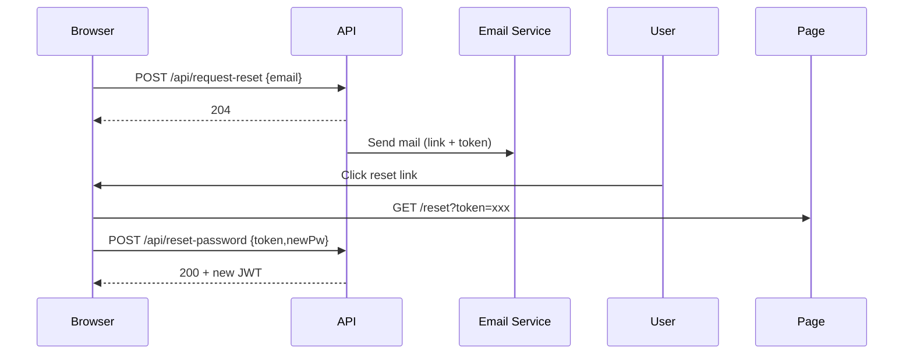

Amv-System 定義書 v1.1.3

## 📄 overview.md

### Amv‑System 概要

| 項目 | 内容 |
|------|------|
| アプリ名 | Amv‑System |
| 目的 | PC ユーザストレージにメモ・レイアウト等を安全に保存／復元できる多機能ワークスペースを提供し、将来的にチャット・音楽・天気などを疎結合モジュールで拡張可能にする |
| ターゲット環境 | PC ブラウザ (Chromium 系優先)／<br>モバイル対応は後日検討 |
| コア設計方針 | - データ本体は常にユーザーストレージ (File System Access API)<br>- 認証情報のみ Cloudflare KV に保存<br>- CloudflareWorkers 上で API を提供 (Pages Functions は使用しない)<br>- UI/UX 一貫・トースト通知統一<br>- AES‑GCM 暗号化を必須として保存データを保護<br>- JSON統一形式 + オプショナルMarkdown書き出し<br>- **適応的インターフェース**による認知負荷軽減 |
| 将来拡張想定 | ローカル自動バックアップ／クラウド同期 (R2)／PWA オフライン／i18n など |

### ⚡ 期待するユーザー体験

- 登録不要ですぐ試用でき、保存したいときだけアカウント登録
- データはローカルに残る安心感
- 起動後すぐ前回の作業を復元してシームレスに継続
- **情報量に応じて自動的に最適化されるUI**
- **検索語が思い浮かばなくても視覚的・文脈的手がかりで情報発見**
- **左サイドバー（ログ管理）のazukiazusa.dev風縦長レイアウト**でストレスフリーな情報管理
- AIによる自動整理・TODO抽出・UI要素生成

## 📄 requirements.md

### 1. 基本機能

| 項目 | 内容 |
|------|------|
| 保存データ | 個別JSONファイル (メモ・URL・画像等を個別管理) |
| 保存場所 | File System Access API 取得ハンドル |
| ファイル形式 | JSON統一 + オプショナルMarkdown書き出し |
| 命名規則 | タイトルベース（255文字制限、memo/memo1/memo2...の重複対応） |
| 認証機能 | メール＋パスワード登録／JWT Secure Cookie |
| 自動ログイン | Cookie 内 JWT 検証 |
| 保存トリガ | **ワンクリック自動分類保存** + 「保存先再選択」ボタン表示 |
| **ハイブリッド検索** | TinySegmenter + TF-IDF検索（基本）+ 将来NLWeb統合 |
| **情報管理システム** | **ハイブリッド適応的ログサイドバー** + **非線形探索支援** |
| **MCP対応** | Model Context Protocol準拠でAIエージェント連携 |
| **URL管理** | URL保存・自動タグ付け・フィルタリング機能 |
| UI | SPA 構成、設定モーダルで各種操作 |
| **右上ボタンエリア** | **設定ボタンのみ（認証時：自動保存インジケーター+設定、ゲスト時：保存ボタン+設定）** |
| **パフォーマンス監視** | **エンドユーザーには非表示（開発者向け機能）** |
| **管理者機能** | **設定モーダル内には配置しない** |
| **AI機能統合** | **下部ツールバー経由での段階的実装（🔍AI検索、🏷️タグ付け、💬チャット、🌐Web検索、🤖AI相談）** |
| テーマ | ダーク／ライト + 背景画像 (5 MB) |
| ログアウト | SettingsModal → Cookie 削除 |

### 2. セキュリティ

| 項目 | 内容 |
|------|------|
| パスワード保存 | bcryptjs (8 ラウンド) |
| パスワードポリシー | 12 文字以上、英字＋数字必須、記号自由 |
| JWT | HS256／Secure Cookie／90 日有効 |
| リフレッシュ | 固定リフレッシュトークン方式 (ローテーションなし) |
| CSRF | SameSite=Strict + ヘッダー・トークン送信 |
| **段階的暗号化** | ログイン時：AES‑GCM + PBKDF2 (クライアントサイド、250,000イテレーション)<br>未ログイン時：平文保存（ユーザーのローカルストレージ） |
| **パスワードリセット** | /api/request-reset → /api/reset-password フロー |
| **データ移行セキュリティ** | クラウド一時保存時の暗号化必須（R2使用） |
| 禁止文字 | `<>:"/\|?*[]{}()#` + 制御文字、先頭ピリオド、末尾スペース・ピリオド |

### 3. 環境対応

Chromium 系メイン、Safari/Firefox は File System Access API 非対応のため保存制限。PWA は将来対応。

### 4. **適応的情報管理システム**

| 項目 | 内容 |
|------|------|
| **適応的インターフェース** | 情報量(10件/50件/200件)に応じてUI自動切り替え |
| **完全自動分類** | 保存時の内容・コンテキスト・行動パターンから自動分類 |
| **多次元想起支援** | 視覚的(色・形状)・時系列的・文脈的記憶トリガー |
| **段階的情報開示** | 認知負荷に応じた情報表示量の動的調整 |
| **ハイブリッド探索** | ブラウジング優先 + 検索語入力時の自動モード切替 |

#### **ハイブリッド適応的サイドバー仕様**

**基本設計**：
- **密度切り替えボタン** `[⋮⋮⋮] [⋮⋮] [⋮]` + **段階的密度変更** + **階層折りたたみ**
- **縦長スクロール表示**（azukiazusa.dev の最新記事欄スタイル - 左サイドバー専用）
- **カテゴリファースト表示** → アイテムは折りたたみで展開

**表示密度**：
```
詳細表示 [⋮⋮⋮]: 2行表示（タイトル+概要+メタ情報）
標準表示 [⋮⋮]:   1行表示（タイトル+時間+重要度）  
密集表示 [⋮]:     アイコンのみ表示
```

**カテゴリ構造**：
```
▼ 📱 Tech (45件)        ← 展開状態
  📄 React Hooks完全ガイド 2h ⭐
  💬 パフォーマンス改善メモ 1d
  🖼️ AWS構成図_v2.png 3d
  ... [もっと見る] (42件)

▶ 📝 Memo (23件)       ← 折りたたみ状態
```

**インタラクション**：
- **ホバー**: 300ms遅延後プレビューパネル表示
- **クリック**: 詳細ビュー + 関連情報表示
- **展開/折りたたみ**: カテゴリヘッダークリック
- **もっと見る**: 密度に応じた表示件数制御

#### **適応的インターフェース詳細**
```
0-10件:    詳細リスト表示（全情報表示）
11-50件:   コンパクトリスト + カテゴリグループ  
51-200件:  カテゴリ折りたたみ + 検索ボックス
200件超:   仮想スクロール + AI支援検索
```

#### **自動分類システム**
- **内容分析**: URL/テキスト/画像の自動解析
- **コンテキスト推論**: 保存時刻・ブラウザ情報・最近の活動
- **プロジェクト推論**: 24時間以内の活動パターンから推論
- **重要度算出**: 内容・緊急性・関連性から自動計算

### 5. 🎨 **UI/UXガイドライン**

#### **右上ボタンエリア制限**
```
認証済みワークスペース:
- 自動保存インジケーター（テキスト表示）
- 設定ボタン（歯車アイコン）のみ

ゲストワークスペース:
- 保存ボタン（手動保存用）
- 設定ボタン（歯車アイコン）のみ

❌ 禁止事項:
- パフォーマンス監視ボタン
- コラボレーション機能ボタン  
- AI支援機能の直接起動ボタン
- その他開発者/管理者向け機能
```

#### **設定モーダル内制限**
```
✅ 許可される設定:
- テーマ切り替え（ダーク/ライト）
- 背景画像設定
- ログアウト機能
- アカウント設定

❌ 禁止される設定:
- パフォーマンス監視制御
- システム診断機能
- 開発者向けデバッグ機能
- 管理者向け権限設定
```

#### **AI機能統合方針**
```
✅ 適切な統合（下部ツールバー経由）:
- 高度な検索機能（TF-IDF + TinySegmenter + 意味検索）
- タグ自動追加機能
- チャット検索機能（対話形式での検索支援）
- Web検索連携機能
- AI話し相手機能（作業支援チャット）
- 各機能は下部ツールバーにボタン追加で実装

✅ バックグラウンド支援:
- 検索エンジン内での自動最適化
- 自動分類・整理の支援機能

❌ 不適切な統合:
- 右上での明示的なAI機能ボタン
- 設定モーダル内でのAI機能制御
- 専用の大型AI支援パネル（ツールバー経由以外）
```

#### **下部ツールバー拡張仕様**
```
現在: [ 📝 メモ ]

将来予定: [ 📝 メモ ] [ 🔍 AI検索 ] [ 🏷️ タグ付け ] [ 💬 チャット ] [ 🌐 Web検索 ] [ 🤖 AI相談 ]

各ボタンの動作:
- 📝 メモ: 新規メモ作成（既存実装）
- 🔍 AI検索: 意味検索・関連メモ発見
- 🏷️ タグ付け: 選択メモへの自動タグ追加
- 💬 チャット: 検索支援チャット（検索語を自然言語で入力）
- 🌐 Web検索: 関連情報のWeb検索とメモ化
- 🤖 AI相談: 作業支援・質問応答チャット
```

#### **エンドユーザー視点の原則**
```
1. シンプルな操作性: 右上は設定のみ、機能は下部ツールバー
2. 直感的なレイアウト: 設定は設定モーダル内、機能は下部ツールバー
3. 段階的機能追加: ツールバーボタンの段階的追加で機能拡張
4. 一貫したUX: 認証状態による機能差は最小限に
```

### 6. 📦 **保存データ仕様**

#### **データ移行方針**
- **バックアップ**: 実装しない
- **クラウド同期**: 基本的に実装しない（デバイス間移行のみ例外）
- **デバイス間移行**: ログイン時にR2一時保存→別端末で受信→自動削除

#### **移行フロー**
```
端末A → 暗号化してR2保存 → 端末B → 復号して復元 → R2データ削除
※ 移行完了の原子性保証（全データ移行完了時に一括削除）
```

#### ディレクトリ構造
```
選択したディレクトリ/
└── Amv_system/
    ├── workspace.json          # ワークスペース設定・レイアウト情報
    ├── memos/
    │   ├── 会議メモ.json
    │   ├── プロジェクト企画.json
    │   └── memo1.json          # 重複時の命名
    ├── urls/
    │   ├── 参考記事_Next.js.json
    │   └── GitHub_リポジトリ.json
    ├── assets/
    │   ├── images/
    │   └── cache/
    └── exports/                # Markdown書き出し用
        └── markdown/
```

#### workspace.json
```json
{
  "version": "2.0",
  "canvas": {
    "width": 1600,
    "height": 900,
    "zoom": 1.5,
    "offsetX": 0,
    "offsetY": 0
  },
  "searchSettings": {
    "indexingMode": "realtime",
    "japaneseNormalization": {
      "hiraganaKatakana": true,
      "fullHalfWidth": true
    }
  }
}
```

#### メモデータ例 (memos/会議メモ.json)
```json
{
  "id": "memo_001",
  "type": "memo",
  "title": "会議メモ",
  "text": "今日の会議内容について...",
  "x": 150,
  "y": 200,
  "w": 240,
  "h": 160,
  "zIndex": 3,
  "tags": ["meeting", "important"],
  "created": "2024-01-01T00:00:00Z",
  "updated": "2024-01-02T00:00:00Z",
  "decorations": [
    {
      "start": 6,
      "end": 8,
      "type": "color", 
      "value": "#ff0000"
    }
  ],
  "appearance": {
    "backgroundColor": "#ffeaa7",
    "borderColor": "#fdcb6e",
    "cornerRadius": 8,
    "shadowEnabled": true
  },
  "linkedUrls": ["url_001"],
  "linkedImages": ["img_001"]
}
```

#### URLデータ例 (urls/参考記事_Next.js.json)
```json
{
  "id": "url_001", 
  "type": "url",
  "url": "https://nextjs.org/docs",
  "title": "Next.js Documentation",
  "x": 300,
  "y": 400, 
  "w": 200,
  "h": 100,
  "tags": ["development", "nextjs", "documentation"],
  "autoTags": ["frontend", "react"],
  "created": "2024-01-01T00:00:00Z",
  "embedData": {
    "description": "The React Framework for Production",
    "image": "cache/previews/nextjs_docs.png",
    "domain": "nextjs.org"
  },
  "linkedMemos": ["memo_001"]
}
```

### 6. 📂 **ファイル保存ポリシー**

| 項目 | 条件 |
|------|------|
| ファイル形式 | JSON |
| 保存方式 | ユーザーPC上個別ファイル保存（File Handle使用） |
| サイズ制限 | 各ファイル推奨 100KB 以内（視覚装飾込み） |
| バックアップ | 実装しない |
| 命名規則 | タイトル255文字制限、重複時memo1/memo2...自動採番 |

#### **制約・特性**
- ブラウザアプリケーションのためデバイス間での完全同期なし
- ユーザーローカル保存のため、各端末で独立管理
- ストレージ不足時は警告表示 + 自動保存無効化

### 7. 🛠️ **サーバー側保存内容（KVストレージ）**

- userId（UUID）
- email  
- passwordHash
- refreshTokenBlacklist（必要に応じて）

**重要**: 保存データ本文（メモ・レイアウトファイル）はサーバー保存しない。

### 8. **UI応答性・パフォーマンス**

#### **Phase 1実装（現実的対応）**
- **画像最適化**: 遅延読み込み + 読み込み中ブラー効果
- **検索最適化**: デバウンス処理（300ms）
- **再レンダリング防止**: React.memo適用
- **適応的表示**: 情報量別UI自動切り替え

#### **パフォーマンス目標**
- **基本動作**: 500件まで快適動作保証
- **応答性**: UI操作200ms以内、検索500ms以内
- **メモリ管理**: 不要なイベントリスナークリーンアップ

#### **スケーラビリティ方針**
- **上限設定**: なし（ユーザーストレージ依存）
- **警告システム**: ストレージ不足時の適切な通知
- **段階的最適化**: 必要に応じて仮想化等を後日実装

## 📄 mcp-integration.md

### **MCP (Model Context Protocol) 実装仕様**

#### **基本設定**
- **実装方式**: Next.js API Routes + MCP Server
- **認証方式**: セッションベース（既存認証流用）
- **プロトコル**: 標準MCPサーバー準拠

#### **MCPツール定義**
```typescript
interface MCPTools {
  search_information: (query: string, filters?: SearchFilters) => SearchResult[];
  get_categories: () => CategoryInfo[];
  add_memo: (content: string, metadata?: Metadata) => LogItem; // ユーザー許可要求
}
```

#### **セキュリティ・権限**
- **機能スコープ**: Read-only検索 + 制限付き追加（Phase 1）
- **データスコープ**: カテゴリ選択制（ユーザー制御）
- **アクセス制御**: 同一オリジン制限 + レート制限（60req/min）
- **監査ログ**: 全MCPアクセス記録（30日保持）

#### **ユーザー体験**
- **設定UI**: Expert-mode（詳細制御可能）
- **透明性**: 詳細ダッシュボード（アクセス状況表示）
- **権限確認**: add_memo実行時にUI内確認プロセス

#### **データ形式**
- **レスポンス**: JSON形式、ISO 8601日時、UTF-8エンコーディング
- **エラー**: JSON-RPC 2.0準拠
- **プライバシー**: PII自動マスキング

## 📄 error-handling.md

### **エラーハンドリング戦略**

#### **File System Access API関連**
- **権限喪失**: モダンフォルダ再選択ダイアログ（強制選択）
- **ファイル破損**: 警告表示→ユーザー判断（無視継続）
- **ディスク容量不足**: 警告表示 + 自動保存無効化

#### **データ整合性**
- **スキーマ検証**: 読み込み時自動チェック
- **参照整合性**: 孤立参照の自動クリーンアップ
- **原子的書き込み**: 一時ファイル経由での安全な保存

#### **ユーザー体験重視**
- **段階的劣化**: 実装しない（Phase 1では考慮外）
- **プロアクティブ検出**: 実装しない
- **復旧支援**: 最小限（警告表示のみ）

#### **実装優先度**
1. ファイルアクセス権限エラー対応（最頻出）
2. データ破損検出・警告（重要度高）
3. ディスク容量監視（実用性高）

## 📄 ui-design-specifications.md

### **左サイドバー（ログ管理）UI詳細仕様**

#### **コンポーネント構造**
```typescript
<AdaptiveSidebar>
  <DensityControls />          // 密度切り替えボタン
  <SearchBox />                // 検索ボックス
  <CategoryList>
    <CategorySection 
      category="tech" 
      defaultExpanded={true}
    >
      <CategoryHeader />       // 折りたたみヘッダー
      <ItemsList 
        density={currentDensity} 
        maxItems={displayCount}
      />
      <ShowMoreButton />       // "もっと見る"ボタン
    </CategorySection>
  </CategoryList>
</AdaptiveSidebar>
```

#### **スタイリング指針**
```css
/* azukiazusa.dev風縦長レイアウト（左サイドバー専用） */
.sidebar-item {
  padding: 8px 12px;
  border-left: 3px solid transparent;
  transition: all 0.2s ease;
}

.sidebar-item:hover {
  border-left-color: #3b82f6;
  background: rgba(59, 130, 246, 0.05);
}

.category-header {
  font-weight: 600;
  padding: 12px 8px;
  background: rgba(0,0,0,0.05);
  border-radius: 6px;
  cursor: pointer;
}

.density-controls {
  position: sticky;
  top: 0;
  background: white;
  border-bottom: 1px solid #e5e7eb;
  z-index: 10;
  display: flex;
  align-items: center;
  gap: 8px;
  padding: 8px;
}
```

#### **密度別表示仕様**

**詳細表示 [⋮⋮⋮]**：
```html
<div class="item-detailed">
  <h4>React Hooks完全ガイド</h4>
  <p class="summary">現代的なReact開発パターン</p>
  <div class="meta">
    <span class="time">2時間前</span>
    <span class="importance">⭐ 重要</span>
    <span class="category">📄 記事</span>
  </div>
</div>
```

**標準表示 [⋮⋮]**：
```html
<div class="item-standard">
  <span class="icon">📄</span>
  <span class="title">React Hooks完全ガイド</span>
  <span class="time">2h</span>
  <span class="importance">⭐</span>
</div>
```

**密集表示 [⋮]**：
```html
<div class="item-compact">
  <span class="icon" title="React Hooks完全ガイド">📄</span>
</div>
```

#### **カテゴリ展開/折りたたみ**
```typescript
interface CategoryState {
  collapsed: boolean;
  itemsShown: number;     // 現在表示中の件数
  totalItems: number;     // カテゴリ内総件数
  showMoreThreshold: number; // "もっと見る"表示閾値
}

// 密度別表示件数
const getDisplayCount = (density: DensityLevel): number => ({
  detailed: 3,    // 詳細表示時は3件まで初期表示
  standard: 5,    // 標準表示時は5件まで初期表示
  compact: 10     // 密集表示時は10件まで初期表示
})[density];
```

#### **インタラクション仕様**
- **カテゴリヘッダークリック**: 展開/折りたたみ切り替え
- **密度ボタンクリック**: リアルタイムUI切り替え + 表示件数再計算
- **もっと見るクリック**: 表示件数を段階的に増加
- **検索入力**: リアルタイム絞り込み + カテゴリ自動展開

## 📄 flow.md

### 起動フロー
```
① トップページ（軽い機能紹介 + [使ってみる]ボタン）
    ↓
② /workspace に遷移 → /api/auto-login 呼び出し
    ├─ JWT 成功 → ログイン済状態でワークスペース復元
    └─ 失敗 → 未ログイン状態で空スペース表示
```

### **情報保存フロー**
```
URL/テキスト入力 → 自動分析 → 自動分類 → サイドバー配置 → 視覚フィードバック
├─ コンテンツ分析（URL→OGP、テキスト→キーワード）
├─ コンテキスト分析（時刻、ブラウザ情報、最近の活動）
├─ プロジェクト推論（24時間以内の活動パターン）
└─ 重要度算出（内容・緊急性・関連性）
```

### **情報探索フロー**
```
【ブラウジングモード】（デフォルト）
サイドバーアイテム → hover（300ms遅延）→ プレビューパネル
                 → click → 詳細ビュー + 関連情報表示

【検索モード】（検索語入力時）
検索ボックス → リアルタイム絞り込み → 結果表示 + マッチ理由可視化
            → 検索語なし時 → 視覚的ブラウジングオプション表示
```

### **適応的UI切り替えフロー**
```
アイテム数検知 → 表示モード決定 → UI自動調整（リアルタイム）
├ 0-10件: 詳細リスト表示
├ 11-50件: コンパクトリスト + カテゴリグループ
├ 51-200件: カテゴリ折りたたみ + 検索ボックス
└ 200件超: 仮想スクロール + AI支援検索

密度切り替え → 表示件数再計算 → カテゴリ内アイテム表示更新
```

### **データ移行フロー**
```
【移行送信】
ローカルデータ → AES-GCM暗号化 → R2一時保存 → 移行コード生成

【移行受信】
移行コード入力 → R2から取得 → 復号 → ローカル保存 → R2データ削除
※ 全データ移行完了時に原子的削除
```

### ログアウトフロー
```
SettingsModal → [ログアウト] → /api/logout → Secure Cookie削除 → 未ログイン状態へ
```

### テーマ & 背景設定フロー

| 操作 | 処理 |
|------|------|
| テーマ切替 | SettingsModal → Toggle (Light/Dark) |
| 背景画像 | SettingsModal → Upload (≤5 MB) |

### 検索フロー
```
検索クエリ入力 → TinySegmenter トークン化 → TF-IDF検索 
→ 結果ランキング → UI表示
（将来: + NLWeb自然言語検索）
```

### MCP連携フロー
```
外部AIエージェント → MCP Request → Amv-System MCP Server
→ search_memos / create_memo / organize_memos → Response
```

## 📄 directory‑structure.md

### （Workers 専用構成に統一）

```
amv-system/
├── frontend/
│   ├── app/
│   │   ├── page.tsx                    # トップページ
│   │   ├── workspace/page.tsx           # ワークスペースページ
│   │   ├── components/
│   │   │   ├── SettingsModal.tsx         # 設定モーダル本体
│   │   │   ├── MemoWindow.tsx           # メモウィンドウ
│   │   │   ├── URLWindow.tsx            # URLウィンドウ
│   │   │   ├── AuthSection.tsx           # 認証セクション
│   │   │   ├── ThemeSection.tsx          # テーマ設定セクション
│   │   │   ├── ResetSettingsButton.tsx   # ユーザー設定リセットボタン
│   │   │   ├── SearchInterface.tsx       # 検索インターフェース
│   │   │   └── MCPServer.tsx             # MCP機能
│   │   ├── stores/
│   │   │   ├── authStore.ts             # 認証管理
│   │   │   ├── memoStore.ts             # メモ状態管理
│   │   │   ├── urlStore.ts              # URL管理
│   │   │   ├── searchStore.ts           # 検索管理
│   │   │   └── mcpStore.ts              # MCP状態管理
│   │   ├── utils/
│   │   │   ├── fileAccess.ts            # File System Access API管理
│   │   │   ├── auth.ts                  # JWT操作・Secure Cookie操作
│   │   │   ├── errors.ts                # エラーハンドリングユーティリティ
│   │   │   ├── i18n.ts                  # 多言語対応ヘルパー
│   │   │   ├── encryption.ts            # クライアントサイド暗号化
│   │   │   ├── search.ts                # TinySegmenter + TF-IDF
│   │   │   ├── urlAnalyzer.ts           # URL自動分析・タグ付け
│   │   │   └── mcpProtocol.ts           # MCPプロトコル実装
│   │   ├── hooks/
│   │   │   ├── useLocalFile.ts          # ファイルアクセス専用Hooks
│   │   │   ├── useHybridSearch.ts       # ハイブリッド検索
│   │   │   ├── useAutoTagging.ts        # 自動タグ付け
│   │   │   └── useMCPTools.ts           # MCPツール管理
│   │   └── lib/
│   │       └── tinySegmenter.ts         # 日本語形態素解析
├── backend/
│   ├── api/
│   │   ├── register.ts                  # ユーザー登録API
│   │   ├── login.ts                     # ログインAPI  
│   │   ├── auto-login.ts                # 自動ログインAPI
│   │   ├── logout.ts                    # ログアウトAPI
│   │   ├── refresh-token.ts             # リフレッシュトークンAPI
│   │   ├── request-reset.ts             # パスワードリセット要求API
│   │   └── reset-password.ts            # パスワードリセット実行API
│   ├── lib/
│   │   ├── auth.ts                      # 認証ロジック共通化
│   │   ├── bcrypt.ts                    # パスワードハッシュ処理
│   │   ├── kv.ts                        # KVストレージユーティリティ
│   │   └── cookie.ts                    # Cookie操作ヘルパー
│   ├── config/
│   │   └── env.ts                       # 環境変数型定義・バリデーション
│   ├── middleware/
│   │   └── authMiddleware.ts            # API認証ガード
│   ├── types/
│   │   └── index.ts                     # 共通型定義（DTOなど）
│   └── hono-app.ts                      # Honoアプリ本体（エントリーポイント）
```

## 📄 technology‑selection.md

### フロントエンド
- Next.js 14, Zustand, Tailwind, Headless UI, Sonner
- **TinySegmenter** (日本語形態素解析)
- **MCP Protocol** (AIエージェント連携)
- **Yup + React Hook Form** (入力フォームバリデーション)

### バックエンド

| 項目 | 技術 |
|------|------|
| 実行基盤 | Cloudflare Workers |
| FW | Hono |
| 認証 | JWT + Secure Cookie |
| Password Hash | bcryptjs (8r) |
| ストレージ | Cloudflare KV |
| 一時保存 | Cloudflare R2（デバイス間移行用） |

CI/CD は GitHub Actions → wrangler deploy。

## 📄 utilities.md

| 関数 | 説明 |
|------|------|
| requestDirectoryHandle | 初回保存用ディレクトリ取得 |
| saveIndividualFile | 個別JSONファイル書込 |
| loadIndividualFile | 個別JSONファイル読込 |
| encryptClientSide / decryptClientSide | AES‑GCM クライアントサイド暗号化（250,000イテレーション） |
| tokenizeJapanese | TinySegmenter日本語トークン化 |
| searchTFIDF | TF-IDF検索実行 |
| autoTagUrl | URL自動タグ付け |
| exportToMarkdown | Markdown形式書き出し |
| **handleMCPRequest** | MCPプロトコル処理 |
| refreshAccessToken | RefreshToken で再認証 |
| **setSecureCookie** | JWT を Secure Cookie に保存 |
| **clearSecureCookie** | ログアウト時にCookie クリア |
| **mapErrorCodeToMessage** | エラーコードをユーザー向けメッセージに変換 |
| **handleApiError** | API通信エラーをトースト通知へ統一変換 |

## 📄 errors.md

### 1. API レスポンスエラー

| コード | HTTP | 意味 | 対処 |
|--------|------|------|------|
| A001 | 400 | バリデーション失敗 | 入力値を確認し再送信 |
| A002 | 401 | 認証失敗 / JWT 失効 | /api/refresh-token を呼び出して再試行 |
| A003 | 403 | CSRF トークン不一致 | ページ再読み込み後操作を再試行 |
| A004 | 404 | リソース未検出 | URL または ID を確認 |
| A005 | 409 | ファイル競合 | ファイル名重複、自動リネーム実行 |
| A006 | 500 | 内部サーバーエラー | 時間を置いて再試行・管理者へ連絡 |

### 2. ファイルシステムエラー

| コード | 意味 | 対処 |
|--------|------|------|
| F001 | File System Access API 非対応 | ブラウザ変更を推奨 |
| F002 | ディレクトリアクセス拒否 | 権限確認・再選択 |
| F003 | ファイル暗号化失敗 | パスワード確認・再入力 |
| F004 | ファイル復号失敗 | パスワード確認・ファイル整合性チェック |

### 3. 検索・MCP エラー

| コード | 意味 | 対処 |
|--------|------|------|
| S001 | 検索インデックス構築失敗 | データ再読み込み・インデックス再構築 |
| S002 | TinySegmenter初期化失敗 | ライブラリ再読み込み |
| M001 | MCPサーバー起動失敗 | ポート確認・プロセス再起動 |
| M002 | MCPツール呼び出し失敗 | パラメータ確認・権限チェック |

## 📄 env.md

### 必須環境変数一覧

| 環境変数名 | 用途 | 例 | 必須 |
|------------|------|----|----- |
| JWT_SECRET | JWT署名用シークレットキー | 超ランダムな32文字以上文字列 | ✅ |
| KV_NAMESPACE_AUTH | Cloudflare KV認証情報保存用ネームスペース | kv_auth_namespace | ✅ |
| KV_NAMESPACE_TOKEN_BLACKLIST | リフレッシュトークン無効化リスト用 | kv_token_blacklist | ✅ |
| R2_BUCKET_MIGRATION | デバイス間移行用R2バケット | migration_bucket | ✅ |
| SITE_URL | サイトのベースURL | https://amv-system.example | ✅ |

### 型付きEnv定義（/backend/config/env.ts）
```typescript
export interface Env {
  JWT_SECRET: string;
  KV_NAMESPACE_AUTH: KVNamespace;
  KV_NAMESPACE_TOKEN_BLACKLIST: KVNamespace;
  R2_BUCKET_MIGRATION: R2Bucket;
  SITE_URL: string;
}
```

## 📄 pwa.md

### PWA対応設計

| 項目 | 内容 |
|------|------|
| PWA対応 | Next.js 公式サポート＋Workbox |
| Service Worker管理 | Workbox自動生成＋カスタムキャッシュ設定 |
| キャッシュ戦略 | pre-cache（重要ファイル）＋runtime cache（APIレスポンス最小限） |
| オフライン動作保証対象 | ワークスペース基本機能（保存・読み取り） |
| インストール可能化 | Web Manifest対応（アイコン/名前/カラー指定） |

### キャッシュポリシー

| タイプ | ポリシー |
|--------|----------|
| Static Assets（CSS/JS） | キャッシュファースト |
| API応答 (/api/auto-loginなど) | ネットワークファースト |
| 背景画像・アイコン素材 | キャッシュファースト |
| メモファイル読み書き | ローカル優先（File System Access API経由） |

## 📄 accessibility.md

### WCAG 2.1 AA 準拠チェックリスト

| 分類 | ガイドライン | 実装方針 |
|------|-------------|----------|
| コントラスト | 4.5:1 以上 | `text-slate-50` + `bg-slate-800` |
| キーボード操作 | すべての操作にTab順序 | `.focus-visible:ring-2` |
| ARIA | role, aria-expanded, aria-label 設定 | Headless UI 拡張 |
| フォーカス管理 | インタラクティブ要素のフォーカスリング明示 | 視覚的フィードバック |

## 📄 CONTRIBUTING.md

### テスト基準

| 種類 | ツール | 合格ライン |
|------|--------|-----------|
| Unit | Vitest + jsdom | **80%** カバレッジ (`--coverage`) |
| E2E | Playwright | 主要フロー（起動〜保存）全通過 |

### Pull Request要件
- 変更概要
- スクリーンショット (UI 変更時)
- 動作確認手順
- WCAG チェック項目

## 📄 reset-password-flow.md

### パスワードリセットフロー



### API仕様

| Endpoint | Method | 説明 |
|----------|--------|------|
| /api/request-reset | POST | リセットトークン生成・メール送信 |
| /api/reset-password | POST | 新パスワード設定・JWT再発行 |

---

**最終更新**: 2025年5月31日  
**ドキュメント責任者**: Amv-System開発チーム